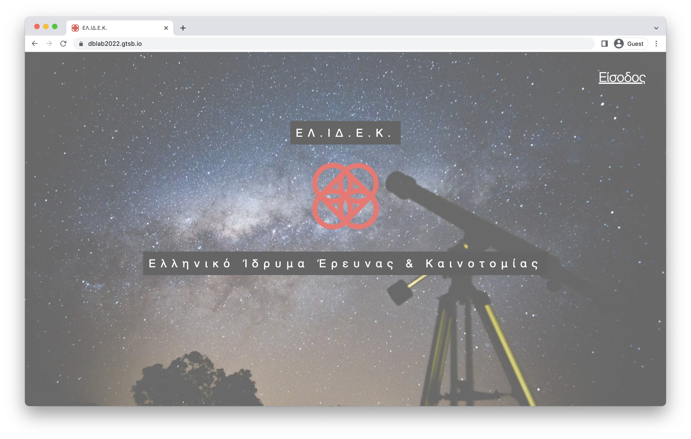
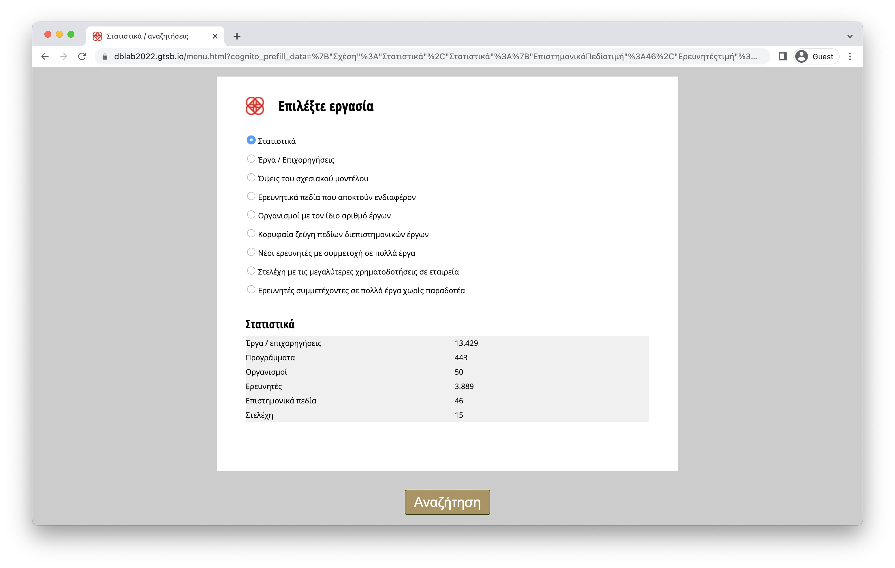

# HFRI Database
A project for the Databases course at Ece Ntua 2021-22, in which we simulate a database system for the Hellenic Foundation for Research & Innovation (HFRI).

## Contributors

- [Karam Konstantinos](https://github.com/KostasKram)
- [Kolios Apostolos](https://github.com/apostolos-k)

## Tech Stack

**Database:** [PostgreSQL](https://www.postgresql.org/)

**Frontend Development:** [HTML](https://www.w3schools.com/html/), [CSS](https://www.w3schools.com/css/)

## Files

`/diagrams` Entity relationship and relational diagrams.

`/documents` Page flowchart and project report.

`/sql` Scripts for creating tables and loading the database with dummy data.

`/src` Api for database and web interface communication.

`/static` Pages of the web interface.

`gatsby-config.js` Defines the site's metadata, plugins, and other general configuration.

`package.json` Information about the technologies, scripts and dependencies used in the software.
## Screenshots

#### Home page

#### Query selection page

## Web Interface

https://dblab2022.gtsb.io/
